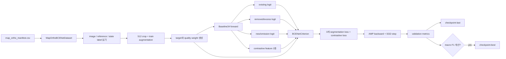

# BCE-Net 논문-구현 대응 검토서

## 1. 문서 목적

이 문서는 BCE-Net 논문에서 제안한 문제 정의와 학습 의도가 현재
`map-ortho` 학습 코드에 어떻게 반영되었는지 추적한다. 목적은 다음 두
주장을 구분하는 것이다.

1. 현재 코드가 BCE-Net의 핵심 아이디어를 사용하고 있는가?
2. 현재 코드가 논문의 학습 절차를 그대로 재현했는가?

검토 결론은 다음과 같다.

> 현재 구현은 저자 저장소의 BCE-Net 모델 구조를 사용하고, reference
> mask를 기준으로 existing/new/removed branch를 구성하며, DCN과
> instance-level contrastive objective를 학습한다. 따라서 **BCE-Net의
> 핵심 의도에 맞는 noisy-label 대응형 fine-tuning 구현**이다. 그러나
> segmentation loss, contrastive loss의 세부 계산, random sample
> generator, augmentation, optimizer schedule, inference 후처리가 논문과
> 다르거나 빠져 있으므로 **논문과 동일한 재현 구현이라고 부를 수는
> 없다.**

검토 기준:

- 논문: Cheng Liao et al., “BCE-Net: Reliable Building Footprints Change
  Extraction based on Historical Map and Up-to-Date Images using Contrastive
  Learning,” ISPRS Journal of Photogrammetry and Remote Sensing, 2023.
- [arXiv 초록](https://arxiv.org/abs/2304.07076)
- [arXiv 원문 PDF](https://arxiv.org/pdf/2304.07076)
- [출판본 DOI](https://doi.org/10.1016/j.isprsjprs.2023.05.011)
- [저자 공개 저장소](https://github.com/liaochengcsu/BCE-Net)
- 구현 기준 commit: `2385e17`
- 학습 결과 기준: `map-ortho-robust-v2-20260720`

## 2. 판정 등급

| 등급 | 의미 |
|---|---|
| 일치 | 논문 정의와 코드의 역할 및 계산이 직접 대응함 |
| 의도 일치·변형 | 목적은 같지만 사용자 데이터 또는 안정성 때문에 계산을 변경함 |
| 미구현 | 논문 구성 요소가 현재 코드에 없음 |
| 검증 필요 | 이름이나 방향은 비슷하지만 논문 수식과 동일함을 코드로 입증하지 못함 |

## 3. 전체 대응표

| 논문 구성 | 논문의 의도 | 현재 구현 | 판정 |
|---|---|---|---|
| 단일 영상 + reference footprint | 두 시점 영상 차분 대신 영상의 건물과 footprint를 검증 | before 영상 + after footprint 사용 | 의도 일치·변형 |
| pre-trained ResNet34 | 다중 레벨 건물 특징 추출 | 저자 `Baseline34`, WHU checkpoint로 초기화 | 일치 |
| existing/new/removed 3개 branch | 변화뿐 아니라 건물 의미도 함께 학습 | existing/omission/excess target을 세 branch에 연결 | 일치 |
| background/foreground feature split | reference 밖/안을 new/removed 판단에 사용 | `New_Fusion`과 reference mask 기반 `mov_out` 사용 | 일치 |
| DCN feature transform module | footprint와 영상 건물의 기하 불일치 완화 | full feature와 new/background feature에 DCNv2 적용 | 일치 |
| BCE + Dice branch loss | 픽셀 분류와 영역 중첩을 함께 최적화 | 현재 실행은 GCE + weighted Dice | 의도 일치·변형 |
| instance contrastive loss | building/background의 객체 단위 표현 분리 | cosine 방향은 구현됐으나 feature 쌍과 평균 방식이 다름 | 검증 필요 |
| random sample generator | 희소한 변화 라벨을 합성하여 불균형 완화 | 없음. positive weight와 신뢰도 가중치로 대체 | 미구현 |
| flip/rotation/scale/color augmentation | 기하·색상 변화 일반화 | flip, 90도 회전, color만 사용 | 의도 일치·변형 |
| SGD, lr 0.01, 최대 100 epoch | 논문 실험 최적화 | SGD, lr 0.001, cosine, 100 epoch | 의도 일치·변형 |
| best evaluation model 저장 | 최적 checkpoint 보존 | validation macro omission/excess F1 기준 | 의도 일치·변형 |
| polygon-level removed 판정 | reference polygon 평균 확률이 0.5 이상일 때 제거 | 현재는 픽셀 threshold 0.5만 계산 | 미구현 |
| precision/recall/F1/IoU | binary change 성능 보고 | existing, omission, excess, combined change별 계산 | 일치·확장 |
| 논문식 ablation | RSG/ICL/DTM 기여 검증 | 아직 실행하지 않음 | 미구현 |

## 3.1 현재 코드의 end-to-end 실행 구조

앞의 표는 판정 요약이다. 실제 코드는 다음 순서로 실행된다.



실행 entry point는
[`main()`](train_bcenet_map_ortho.py#L440-L670)이다.

```text
main
 ├─ make_loader(split="train")       -> train 800장
 ├─ make_loader(split="val")         -> validation 100장
 ├─ make_visual_dataset(split="val") -> 고정 정성 샘플
 ├─ build_model()                    -> CDResWHU.Baseline34
 ├─ BCENetCriterion(LossConfig)
 ├─ SGD + CosineAnnealingLR + GradScaler
 └─ epoch loop
     ├─ run_epoch(train)
     ├─ run_epoch(validation)
     ├─ metric와 JSONL 기록
     ├─ checkpoint-last 저장
     ├─ macro F1 개선 시 checkpoint-best 저장
     └─ curve와 qualitative PNG 저장
```

test 100장은 이 실행 흐름에 들어가지 않는다. 현재 trainer에는 test
evaluation이나 전체 1024 inference entry point가 아직 없다.

## 3.2 dataset 코드가 만드는 실제 tensor

구현 위치:

- [`MapOrthoBCENetDataset`](dataset/bcenet_map_ortho.py#L184-L329)
- [`derive_targets_and_weights`](dataset/bcenet_map_ortho.py#L106-L181)
- [`make_loader`](train_bcenet_map_ortho.py#L284-L314)

`__getitem__`은 한 manifest row에 대해 다음을 수행한다.

```text
1. before RGB image, after footprint mask, state label을 읽는다.
2. 세 파일의 공간 크기가 같은지 확인한다.
3. 1024×1024에서 512×512를 crop한다.
   - train: 중앙 위치에서 x/y 각각 최대 128 pixel jitter
   - validation: 정확한 중앙 crop
4. BGR을 RGB로 바꾼다.
5. train이면 image/mask/label에 동일한 flip/rotation을 적용한다.
6. image에만 brightness/contrast 변환을 적용한다.
7. state label과 footprint로 branch target과 loss weight를 만든다.
8. image를 float [0,1], mask와 target을 float tensor로 변환한다.
```

target 생성 코드는 다음 식을 그대로 구현한다.

```python
reference = map_mask > 0
unchanged = state_label == 1
omission = state_label == 2
excess = state_label == 3
existing = unchanged | omission

target_existing = existing
target_new_head = omission
target_removed_head = excess
```

각 batch가 model과 criterion에 제공하는 핵심 tensor:

| key | 예상 shape | 의미 |
|---|---|---|
| `image` | `[B,3,512,512]` | before RGB |
| `reference_mask` | `[B,512,512]` | after footprint, class 1 or 3 |
| `target_existing` | `[B,1,512,512]` | class 1 or 2 |
| `target_new_head` | `[B,1,512,512]` | omission, class 2 |
| `target_removed_head` | `[B,1,512,512]` | excess, class 3 |
| `weight_existing` | `[B,1,512,512]` | existing loss 신뢰도 |
| `weight_new_head` | `[B,1,512,512]` | omission loss 신뢰도 |
| `weight_removed_head` | `[B,1,512,512]` | excess loss 신뢰도 |

quality weight는 target과 별개의 tensor다.

```text
기본 픽셀                         = 1.0
2-pixel common boundary           = 0.25
구조적으로 모순된 픽셀            = 0.0
crop 중심 객체가 아닌 변화 픽셀   = 최대 0.5
```

즉 current code는 라벨을 지우거나 수정하지 않고, 의심 픽셀이 loss에
기여하는 정도를 줄인다.

## 3.3 `Baseline34.forward`가 계산하는 실제 branch

구현 위치:

- [`New_Fusion`](Testmodel/CDResWHU.py#L602-L640)
- [`Baseline34.__init__`](Testmodel/CDResWHU.py#L1215-L1269)
- [`Baseline34.forward`](Testmodel/CDResWHU.py#L1271-L1339)

model 호출:

```python
outputs = model(image, reference_mask)
```

### 공통 encoder

```python
e11, e12, e13, e14 = self.resnet_features(image)
```

ResNet34의 네 해상도 feature를 각각 convolution과 batch normalization에
통과시킨다. 이후 두 decoder 경로가 이 feature들을 사용한다.

### new/omission 경로

`New_Fusion`은 multi-level feature를 위로 복원한 뒤 reference를
convolution으로 축소하여 background-side feature를 만든다.

```python
lab = self.conv_lab(reference.unsqueeze(1))
backfeat = decoded_feature * (1 - lab)
```

`Baseline34.forward`에서는 다음 순서다.

```python
fu_new, featn = self.fusin(e1, e2, e3, e4, reference)
fu_new = self.sel(fu_new)
fu_new = self.dcn(fu_new.float())
new_out = self.conv_lab2(self.bnorm2(self.conv_lab1(fu_new)))
```

`new_out`은 논문 이름과 달리 현재 데이터에서는
`target_new_head=omission/class 2`로 학습된다.

### existing 경로

별도 decoder가 ResNet feature를 순차적으로 upsample/concatenate하고
SE attention과 DCN을 적용한다.

```python
d4f = self.sel(decoded_full_feature)
d4f = self.dcn(d4f.float())
d4 = interpolate(self.norm4(d4f), input_size)
existing_out = self.finalseg(d4)
```

`existing_out`은 `class 1 or class 2`로 supervision된다. 이 auxiliary
building task가 변화 label만 보지 않고 영상의 building semantics를
encoder에 주입한다.

### removed/excess 경로

removed output은 DCN을 지난 full feature의 building probability를
뒤집고 reference 내부만 남긴 뒤 convolution한다.

```python
removed_out = self.finalmov(
    (1 - torch.sigmoid(d4)) * reference.unsqueeze(1)
)
```

따라서 reference에는 있지만 영상 feature가 building이라고 보지 않는
영역을 높은 removed 후보로 만든다. 현재 데이터에서는
`target_removed_head=excess/class 3`로 학습된다.

### contrastive feature 출력

```python
feat_all = interpolate(self.segblock(d4f), input_size)
feat_mov = interpolate(self.segblock(featn), input_size)

return existing_out, removed_out, new_out, feat_all, feat_mov
```

실제 output 5개의 shape는 모두 `[B,1,512,512]`다. trainer와 loss에서는
마지막 두 개를 `feature_all`, `feature_split`으로 부른다.

여기서 중요한 검증 한계가 생긴다. 논문은 `F`, `F_BG`, `F_FG` 세 역할을
정의하지만 model은 contrastive 계산용으로 두 tensor만 반환한다.
현재 criterion은 이 한 pair를 omission과 excess에 모두 사용한다.
더 구체적으로 `New_Fusion`은 `(backfeat, outf)`를 반환하지만
`Baseline34`의 `featn`에는 두 번째 값인 mask 적용 전 `outf`가 들어간다.
따라서 `feat_mov = segblock(featn)`을 이름만으로 `F_BG` 또는 `F_FG`라고
간주할 수 없다.

## 3.4 current loss의 실제 계산

구현 위치:

- [`weighted_pixel_loss`](utils/bcenet_loss.py#L24-L52)
- [`weighted_dice_loss`](utils/bcenet_loss.py#L55-L73)
- [`instance_contrastive_loss`](utils/bcenet_loss.py#L99-L185)
- [`BCENetCriterion`](utils/bcenet_loss.py#L202-L274)

criterion은 model output을 다음처럼 해석한다.

```python
existing, removed, new, feature_all, feature_split = outputs
```

그리고 target을 다음처럼 연결한다.

```text
existing <-> target_existing
removed  <-> target_removed_head = excess
new      <-> target_new_head = omission
```

### 완료 실행의 GCE

logit을 `z`, target을 `y`, sigmoid probability를 `p`라고 하면:

```text
p_t = y p + (1-y)(1-p)
GCE(z,y) = (1 - p_t^q) / q
q = 0.7
```

양성 class weight와 quality weight를 결합한다.

```text
class_weight = 1 + y (positive_weight - 1)
effective_weight = quality_weight × class_weight

L_pixel =
  Σ(effective_weight × GCE)
  / Σ(effective_weight)
```

omission/excess의 `positive_weight=4`이므로 양성 픽셀은 같은 quality의
음성 픽셀보다 4배 큰 weight를 가진다. `--pixel-loss bce`를 선택하면
같은 weighting 구조에서 GCE 대신 BCEWithLogits를 사용한다.

### weighted Dice

현재 구현의 sample별 Dice loss:

```text
L_Dice =
  1 - (2 Σ(w p y) + 1)
      / (Σ(w p) + Σ(w y) + 1)
```

각 branch segmentation loss:

```text
L_existing = L_pixel_existing + L_Dice_existing
L_removed  = L_pixel_removed  + L_Dice_removed
L_new      = L_pixel_new      + L_Dice_new
```

### current instance contrastive

각 batch sample과 변화 target에 대해:

```text
1. target의 8-connected component를 찾는다.
2. area < 16이면 제외한다.
3. component 내부 quality 평균 < 0.5이면 제외한다.
4. component bounding rectangle를 구한다.
5. rectangle 안에서도 component pixel만 feature vector로 선택한다.
6. feature_all과 feature_split에 sigmoid를 적용한다.
7. 두 vector의 cosine similarity D를 계산한다.
```

term:

```text
omission/new component:   0.5 × (1 - D)
excess/removed component: 0.5 × (1 + D)
```

모든 omission/excess component term을 한 list에 넣어 단순 평균한다.

```text
L_contrastive = mean(all component terms)
```

최종 loss:

```text
L_total =
  L_existing
  + L_removed
  + L_new
  + contrastive_weight × L_contrastive
```

완료 실행의 `contrastive_weight=1`이다.

## 3.5 backward, metric, checkpoint 코드

구현 위치:

- [`run_epoch`](train_bcenet_map_ortho.py#L195-L280)
- [`save_checkpoint`](train_bcenet_map_ortho.py#L412-L437)
- [epoch loop](train_bcenet_map_ortho.py#L536-L670)

train batch:

```python
optimizer.zero_grad(set_to_none=True)
with autocast(float16):
    outputs = model(image, reference)
    loss, details = criterion(outputs, batch)
scaler.scale(loss).backward()
scaler.step(optimizer)
scaler.update()
```

DCNv2 호출 내부에서만 autocast를 끄고 FP32로 변환한다. validation은 같은
forward와 criterion을 사용하지만 gradient와 optimizer step을 끈다.

metric 계산:

```python
existing_prediction = sigmoid(existing_logit) >= 0.5
omission_prediction = sigmoid(new_logit) >= 0.5
excess_prediction = sigmoid(removed_logit) >= 0.5
combined_change = omission_prediction | excess_prediction
```

각각 TP/FP/FN을 누적해 precision, recall, F1, IoU를 계산한다.

best selection:

```text
macro_change_f1 = (omission_f1 + excess_f1) / 2
```

- 매 epoch `checkpoint-last.pth`를 덮어쓴다.
- macro F1이 이전 최고보다 클 때만 `checkpoint-best.pth`를 덮어쓴다.
- omission 또는 excess prediction rate가 3 epoch 연속 `1e-5` 이하이면
  branch collapse로 보고 중단한다.
- cosine scheduler는 epoch마다 한 번 step한다.

## 3.6 완료 실행에서 코드가 받은 실제 설정

`training_monitor/current/config.json` 기준:

```text
model_variant=whu
init_checkpoint=checkpoint-best-whu.pth
epochs=100
batch_size=4
crop_size=512
train_jitter=128
lr=0.001
momentum=0.9
weight_decay=0.0001
scheduler=cosine
pixel_loss=gce
gce_q=0.7
pixel_loss_weight=1
dice_weight=1
contrastive_weight=1
contrastive_min_area=16
positive_weight_existing=1
positive_weight_new=4
positive_weight_removed=4
boundary_width=2
boundary_weight=0.25
secondary_change_weight=0.5
threshold=0.5
seed=1024
AMP=true
best_metric=macro_change_f1
```

따라서 이후 절의 논문 대응 판정은 추상적인 설계 추정이 아니라, 위
실행 흐름과 실제 config를 기준으로 한다.

## 4. 입력 방향과 branch 의미

### 4.1 논문 정의

논문은 다음을 입력으로 사용한다.

- `I`: up-to-date image
- `M`: historical building mask
- `U`: unchanged building
- `N`: newly constructed building, 즉 `I`에는 있으나 `M`에는 없음
- `R`: removed building, 즉 `M`에는 있으나 `I`에는 없음
- `E`: up-to-date image에 존재하는 building

집합 관계는 다음과 같다.

```text
M = U ∪ R
E = U ∪ N
N = E \ M
R = M \ E
```

논문 Section 4.5는 image와 mask의 시간 순서와 무관하게 changed building을
식별할 수 있다고 설명한다.

### 4.2 현재 데이터 정의

현재 데이터는 논문과 시간 방향이 반대다.

- `I_user`: before 영상
- `M_user`: after footprint
- class 1: before와 after footprint 모두 건물
- class 2, omission: before에는 있으나 after footprint에는 없음
- class 3, excess: after footprint에는 있으나 before에는 없음

따라서 다음 mapping이 성립한다.

```text
reference M_user = class 1 ∪ class 3
existing E_user  = class 1 ∪ class 2
paper H_N 역할  = class 2 omission
paper H_R 역할  = class 3 excess
```

이 mapping은
[`derive_targets_and_weights`](dataset/bcenet_map_ortho.py#L106-L181)에
직접 구현되어 있다.

| 논문 branch | 논문 시간 의미 | 현재 데이터의 집합 의미 | 코드 target |
|---|---|---|---|
| `H_E` | up-to-date image의 existing building | before 영상의 building | `target_existing = 1 or 2` |
| `H_N` | image에는 있고 reference에는 없음 | before에는 있고 after footprint에는 없음 | `target_new_head = 2` |
| `H_R` | reference에는 있고 image에는 없음 | after footprint에는 있고 before에는 없음 | `target_removed_head = 3` |

판정은 **집합 논리 일치, 시간 명칭 변형**이다. 현재 결과를 설명할 때
`new_out`을 시간적 신규 건물이라고 부르면 안 된다. 현재 데이터에서는
`new_out`이 omission/class 2다.

## 5. encoder, feature split, multi-task branch

논문 Section 3.1~3.2의 구조:

1. pre-trained ResNet34에서 multi-level feature 추출
2. upsampling과 concatenation으로 feature `F` 생성
3. reference `M` 기준으로 `F_BG`, `F_FG` 분할
4. `H_N`, `H_R`, `H_E`가 new, removed, existing을 각각 예측

현재 구현:

- [`Baseline34`](Testmodel/CDResWHU.py#L1215-L1339)가 ResNet34와
  multi-level decoder를 사용한다.
- [`New_Fusion`](Testmodel/CDResWHU.py#L602-L640)이 reference를 이용해
  background-side feature를 만든다.
- existing 출력은 `out`, removed-side 출력은 `mov_out`, new-side 출력은
  `new_out`이다.
- trainer는 출력 순서를
  `existing, removed, new, feature_all, feature_split`으로 해석한다.
- 공개 WHU checkpoint는 strict loading되므로 parameter key와 tensor shape가
  모두 맞지 않으면 학습이 시작되지 않는다.

이 부분은 저자 저장소 모델을 사용하므로 **구조적으로 가장 강하게
일치하는 부분**이다.

## 6. DCN feature transform module

논문 Section 3.3의 의도는 reference footprint와 영상의 rooftop/facade
사이에 생기는 offset을 고정 grid convolution 대신 학습 가능한 offset으로
완화하는 것이다. 논문은 full fused feature와 split feature를 DCN으로
조정한다고 설명한다.

현재 구현:

- `self.dcn = DCN(...)`:
  [`CDResWHU.py`](Testmodel/CDResWHU.py#L1269)
- full feature 변환:
  [`d4f = self.dcn(d4f.float())`](Testmodel/CDResWHU.py#L1310-L1314)
- new/background feature 변환:
  [`fu_new = self.dcn(fu_new.float())`](Testmodel/CDResWHU.py#L1325-L1327)
- removed 출력은 변환된 `d4`와 reference mask를 결합한다.

구형 DCNv2 kernel이 FP16을 지원하지 않아 DCN 구간만 FP32로 실행한다.
이는 수학적 역할을 변경하지 않는 실행 호환 수정이므로 논문 의도를
보존한다.

판정은 **일치**다. 다만 실제 offset 개선 효과를 입증하려면 DCN on/off
ablation이 필요하다.

## 7. segmentation loss 대응

### 7.1 논문 수식

논문 Formula (2), (4), (5):

```text
L_N = α L_B(P_N, L_N) + β L_D(P_N, L_N)
L_R = α L_B(P_R, L_R) + β L_D(P_R, L_R)
L_E = α L_B(P_E, L_E) + β L_D(P_E, L_E)
```

`L_B`는 binary cross entropy, `L_D`는 Dice loss다. 논문 본문은
`α`, `β`를 weighting으로 정의하지만 검토한 implementation detail에는
그 수치가 명시되어 있지 않아 수치 수준의 동일성은 확인할 수 없다.

### 7.2 현재 구현

[`segmentation_loss`](utils/bcenet_loss.py#L76-L96)는 pixel loss와 weighted
Dice를 합한다. 코드는 BCE를 지원하지만 현재 완료된 실행은 다음
설정이었다.

```text
pixel loss = GCE(q=0.7)
pixel weight = 1
dice weight = 1
positive weight: existing=1, omission=4, excess=4
boundary weight = 0.25
secondary change weight = 0.5
```

추가된 목적:

- GCE: 큰 loss를 내는 의심 라벨의 영향 완화
- boundary weight: rasterization/정합 오차가 많은 경계 완화
- secondary change weight: crop 중심이 아닌 부수 변화 객체의 신뢰도 완화
- positive weight: 희소 변화 branch의 all-background collapse 방지

판정은 **논문의 BCE+Dice 의도는 유지하지만 계산은 명시적으로 변형**이다.
완료된 모델은 paper-faithful loss 모델이 아니라 robust loss 모델이다.

## 8. instance-level contrastive loss 대응

### 8.1 논문 수식과 의도

논문 Formula (7):

```text
L_C =
  1/(2N) Σ_n [1 - D(F_BG^n, F^n)]
  + 1/(2R) Σ_r [1 + D(F^r, F_FG^r)]
```

- new instance에서는 `F_BG`와 `F`를 가깝게 만든다.
- removed instance에서는 `F`와 `F_FG`를 멀게 만든다.
- `D`는 cosine similarity다.
- instance bounding box의 feature patch를 비교한다.
- 비교 전 1×1 convolution, normalization, sigmoid로 one-channel feature를
  만든다.

### 8.2 현재 구현에서 맞는 부분

[`instance_contrastive_loss`](utils/bcenet_loss.py#L99-L185):

- connected component를 instance로 찾는다.
- cosine similarity를 사용한다.
- omission/new term은 `0.5 * (1 - similarity)`로 가깝게 만든다.
- excess/removed term은 `0.5 * (1 + similarity)`로 멀게 만든다.
- total loss에 segmentation 3개와 contrastive term을 합한다.

따라서 contrastive objective의 **방향과 전체 loss 구성은 논문과
일치**한다.

### 8.3 정확한 재현으로 볼 수 없는 부분

| 논문 | 현재 구현 | 영향 |
|---|---|---|
| new와 removed를 각각 `1/(2N)`, `1/(2R)`로 평균 | 두 클래스의 모든 instance term을 한 번에 평균 | instance가 많은 클래스의 비중이 커짐 |
| bounding box 전체 feature patch | bounding box 안 connected-component 픽셀만 선택 | 배경 문맥이 contrastive vector에서 빠짐 |
| `F`, `F_BG`, `F_FG` 세 feature 역할 | `feature_all`, `feature_split` 한 쌍을 두 클래스에 재사용 | 논문이 요구한 두 종류 split pair인지 입증되지 않음 |
| 1×1 conv + normalization + sigmoid | 모델의 3×3 `segblock`, loss에서 sigmoid, 별도 normalization 없음 | feature projection이 수식 설명과 다름 |
| 모든 유효 instance | 최소 면적 16, 평균 신뢰도 0.5 이상만 사용 | noisy label 대응을 위한 추가 필터 |

특히
[`Baseline34.forward`](Testmodel/CDResWHU.py#L1332-L1339)는
`feat_all`과 `feat_mov` 두 개만 반환하고, criterion은 같은 pair를
omission/excess에 모두 사용한다. 이 부분은 **논문 의도는 반영됐지만
수식과 동일하다고 확인할 수 없는 핵심 검증 항목**이다.

## 9. random sample generator

논문 Section 3.4는 변화 객체가 unchanged/background보다 훨씬 적다는
문제를 해결하기 위해 다음 label augmentation을 사용한다.

- background에 일정 면적과 각도를 가진 removed-building mask 생성
- 기존 unchanged building 일부를 newly-constructed label로 변경

현재 dataset과 trainer에는 이 random sample generator가 없다. 대신
positive weight 4와 crop 중심 후보 sampling을 사용한다. 두 방법 모두
불균형 완화가 목적이지만 동작은 다르다.

판정은 **미구현**이다. 논문 재현을 주장하려면 별도 구현과 on/off
ablation이 필요하다. 사용자 데이터의 라벨 오류가 많으므로 합성 라벨이
실제 영상 의미와 모순되지 않는지도 먼저 정의해야 한다.

## 10. augmentation과 최적화

| 항목 | 논문 | 완료된 robust 실행 |
|---|---|---|
| augmentation | random flip, rotation, scaling, color enhancement | flip, 90도 rotation, brightness/contrast |
| crop | 논문 데이터셋별 상세 crop 정책 불명확 | 1024에서 512 crop, train jitter 128 |
| optimizer | SGD | SGD |
| initial LR | 0.01 | 0.001 |
| scheduler | 논문은 구체 정책 미기재 | cosine annealing |
| epochs | 최대 100 | 100 |
| initialization | pre-trained ResNet34 | 저자 WHU best checkpoint |
| best model | best evaluation result | validation macro omission/excess F1 |
| AMP | 미기재 | 사용, DCNv2만 FP32 |

학습률 0.001과 WHU checkpoint 초기화는 scratch reproduction이 아니라
domain fine-tuning을 위한 선택이다. 첫 0.01 진단 실행에서 omission
branch가 붕괴했기 때문에 안정성을 우선했다.

## 11. inference와 평가 대응

논문:

- precision, recall, F1, IoU를 binary change mask에 대해 보고한다.
- removed building은 reference polygon 내부의 평균 probability가
  `θ=0.5`보다 높을 때 removed polygon으로 판정하고 regularize한다.
- module별 ablation으로 RSG, ICL, DTM의 효과를 확인한다.

현재 구현:

- existing, omission, excess, combined change 각각의 pixel metric을 계산한다.
- best checkpoint는 한 branch 붕괴를 숨기지 않도록 omission/excess
  macro F1로 선택한다.
- pixel threshold는 0.5다.
- polygon 평균 probability와 regularization은 구현되지 않았다.
- 학습 중 train 800장과 validation 100장만 사용했다.
- test 100장은 아직 독립 평가하지 않았다.

따라서 현재 validation F1을 논문의 SI-BU/WHU F1과 직접 비교하면 안 된다.
데이터, 시간 방향, split, loss, checkpoint 초기화, best metric이 모두
다르다.

## 12. 완료된 학습이 입증하는 것

완료 실행:

```text
output: /home/work/models/BCE-Net/map-ortho-robust-v2-20260720
epochs: 100
best checkpoint: epoch 24
best macro F1: 0.729859
best combined change F1: 0.736561
best omission F1: 0.758699
best excess F1: 0.701018
```

이 결과가 입증하는 것:

- 세 segmentation output과 contrastive output에 gradient가 흐른다.
- DCNv2를 포함한 forward/backward가 100 epoch 동안 동작한다.
- omission/excess 두 branch가 모두 non-zero prediction을 유지한다.
- 저자 WHU checkpoint를 사용자 데이터에 fine-tuning할 수 있다.
- 정성 결과가 초기보다 객체 중심으로 정돈된다.

입증하지 못하는 것:

- 논문 Formula (7)의 feature pair를 정확히 구현했다는 것
- random sample generator의 효과
- DCN/contrastive loss 각각의 독립적 기여
- 깨끗한 unseen test에서의 일반화 성능
- 논문 보고 수치의 재현

## 13. 논문 충실도 확인을 위한 다음 실험

### P0: 결과 사용 전에 필요한 항목

1. `checkpoint-best.pth`로 test 100장을 독립 평가한다.
2. test prediction과 label을 정성 검수하여 clean audit subset을 만든다.
3. 1024×1024 전체 영역을 512 overlap tile로 추론하는 코드를 만든다.
4. removed/excess reference polygon 평균 확률과 regularization을 구현한다.

### P1: 논문 의도 검증에 필요한 항목

1. `F`, `F_BG`, `F_FG`를 명시적으로 반환하도록 model output을 정리한다.
2. paper Formula (7)를 클래스별 평균과 bounding-box patch 기준으로 구현한다.
3. projection을 1×1 conv + normalization + sigmoid로 맞춘다.
4. contrastive loss의 feature 방향을 synthetic unit test로 검증한다.
5. random sample generator를 별도 option으로 구현한다.
6. random scaling augmentation을 추가한다.
7. 동일 spatial split과 seed로 다음 ablation을 실행한다.

```text
A. 3-head baseline
B. A + 일반 augmentation/attention
C. B + random sample generator
D. C + exact instance contrastive loss
E. D + DCN transform
F. 현재 robust GCE/weight profile
```

### P2: 재현 주장에 필요한 항목

1. 논문과 동일한 public SI-BU 또는 WHU 변환 데이터로 학습한다.
2. 논문과 동일한 split과 binary change metric을 사용한다.
3. optimizer와 augmentation 정책을 논문 조건으로 고정한다.
4. 여러 seed의 평균과 분산을 보고한다.

## 14. 사용할 수 있는 표현

현재 사용할 수 있는 표현:

> 저자 공개 BCE-Net 구조를 기반으로 before image와 after footprint의
> 집합 관계를 역방향으로 매핑하고, noisy-label 대응 GCE/weighting을
> 추가한 domain fine-tuning 모델이다.

아직 사용하면 안 되는 표현:

> BCE-Net 논문을 그대로 재현했다.

> 논문보다 성능이 높거나 낮다.

> validation F1이 실제 전체 지역 일반화 성능이다.

## 15. 최종 판정

| 질문 | 답 |
|---|---|
| BCE-Net의 핵심 문제 설정을 사용했는가? | 예. 시간 방향은 반대지만 set relation은 일치한다. |
| 3개 branch와 building semantic auxiliary task가 있는가? | 예. |
| DCN을 논문의 목적에 맞게 사용하는가? | 예. |
| contrastive learning의 방향이 맞는가? | 예. |
| contrastive loss가 Formula (7)과 정확히 같은가? | 아니며 추가 구현·검증이 필요하다. |
| 논문 BCE+Dice 학습인가? | 코드는 BCE를 지원하지만 완료 실행은 GCE+Dice다. |
| random sample generator가 있는가? | 없다. |
| 논문 재현이라고 부를 수 있는가? | 아니다. BCE-Net 기반 robust adaptation이다. |
